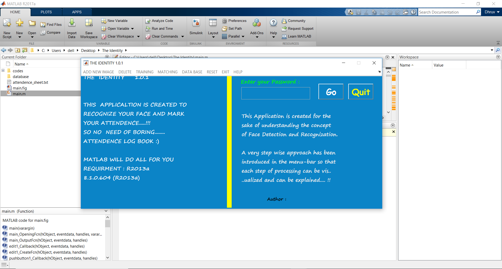

# The-Identity

This is a project that uses any USB web cam or LAPTOP web cam attached with your computer. 
This GUI based application automatic identifies a face and matches it with the database created. 
It also marks attendance on Notepad. Ignore the message with "COM PORT" because in my Project I also connected hardware.
Algorithm used: Color moment.

Working of the project.

You can also see the documentation of the project above. (PDF file)

